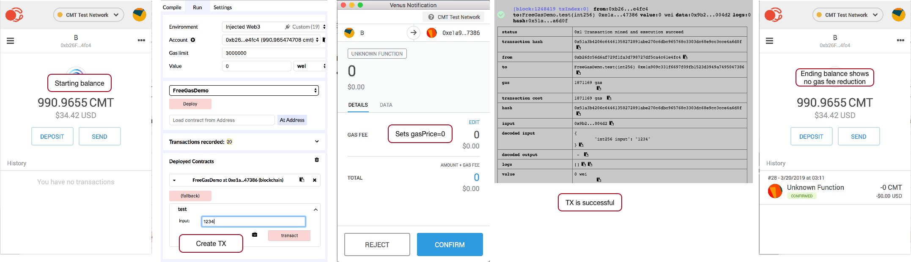

+++
title = "Free Gas"
date = 2018-06-22T15:00:50+08:00
weight = 8
chapter = true
disabletoc = false
+++

# "Free" Gas

One of the major hurdles of blockchain application adoption is that end users are asked to pay a `gas` fee in order to perform certain functions on the blockchain. The gas mechanism is crucial for the blockchain's security, as it prevents DoS attackers from overwhelming the blockchain nodes with computationally intensive requests. However, the gas requirement also means that new end users must be taught to purchase cryptocurrencies and manage private keys before they can even start to use decentralized applications.

Lity provides an alternative approach to onboard new users to blockchain applications. Through the `freegas` keyword, the smart contract owner can designate that some or all functions in a contract should be paid by the owner herself. When the user calls those functions, she would not need to send a gas fee with the transaction. Instead, the appropriate gas fee would be deducted from the contract owner's account.

Below is an example. On the CyberMiles blockchain, the `test` function can be called without gas by the end user. That is to set `gas = 0` or `gasPrice = 0` in the transaction.

```
pragma lity >= 1.2.7;

contract FreeGasDemo {
  int a;
  function test (int input) public freegas returns (int) {
    a = input;
    return a;
  }

  function () public payable {}
}
```

Notice that the `payable` function is important as it allows the contract to receive CMTs that will later be used as gas. If the contract address runs out of funds, the `test` function will require gas fees from the function caller.

The screen shots below show the free gas contract function in action.


Compile and deploy the contract using Europa IDE and Venus Wallet on CyberMiles blockchain.


Fund some CMTs to be used as gas fees to the contract address.



Execute the contract function without any gas from the user transaction.

